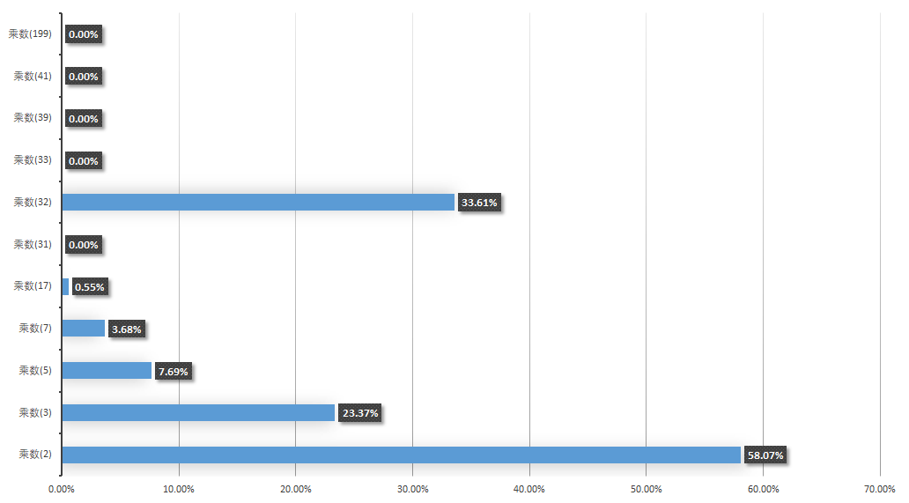

# String

## 方法解释

### hashCode

为什么选择31作为乘积值

```java
public int hashCode() {
    int h = hash;
    if (h == 0 && value.length > 0) {
        char val[] = value;
        for (int i = 0; i < value.length; i++) {
            h = 31 * h + val[i];
        }
        hash = h;
    }
    return h;
}
```

1. 31 是一个奇质数，如果选择偶数会导致乘积运算时数据溢出。
2. 另外在二进制中，2个5次方是32，那么也就是 `31 * i == (i << 5) - i`。这主要是说乘积运算可以使用位移提升性能，同时目前的JVM虚拟机也会自动支持此类的优化。
3. 用超过5千个单词计算hashCode，得到的碰撞结果，31被使用就很正常了。

测试103976个单词的hashCode的碰撞实验结果图：



以上就是不同的乘数下的hash碰撞结果图标展示，从这里可以看出如下信息；

1. 乘数是2时，hash的取值范围比较小，基本是堆积到一个范围内了，后面内容会看到这块的展示。
2. 乘数是3、5、7、17等，都有较大的碰撞概率
3. **「乘数是31的时候，碰撞的概率已经很小了，基本稳定。」**
4. 顺着往下看，你会发现199的碰撞概率更小，这就相当于一排奇数的茅坑量多，自然会减少碰撞。**「但这个范围值已经远超过int的取值范围了，如果用此数作为乘数，又返回int值，就会丢失数据信息」**。

### indexOf

此方法没有使用KMP算法，而是直接进行暴力匹配，理由可能是因为程序中大多数的字符串比较短，而KMP算法需要初始化计算以及分配内存故而在较短的字符串中使用暴力效率更高。

### intern

如果字符串常量池中包含次字符串，则返回此字符串的引用，否则 将此字符串添加到字符串常量池池中并返回其在常量池中的引用

```java
String b = new String("abc");
System.out.println(b.intern()==b);//false
```

并且需要注意的是使用new创建的字符串对象并不会进入字符串常量池中，使用静态方法创建的则会进入字符串常量池中如：

```java
String a="abc";
String c = new String("abc");
System.out.println(a==c);//false
System.out.println(a.intern()==a);//true
```

使用静态方法创建字符串时，首先会在字符串常量池中查找是否有此字符串，如果equals比较相等则存在返回此字符串的常量池地址，不存在则添加此字符串到常量池中并返回其地址：

```java
String a="abc";
String b="abc";
System.out.println(a==b);//true
```

## 注释解释

在源码注释中存在着这么语句注释

```java
/* avoid getfield opcode */
```

其意思是避免使用getfield操作码。

对下面这段代码进行反编译：

```java
public class Main{
    char[] chars=new char[10];

    int tt(){
        char c1=chars[0];
        char c2=chars[1];
        char c3=chars[2];
        return c1 + c2 + c3;
    }
}
```

其中tt()方法为：

```class
int tt();
    Code:
       0: aload_0
       1: getfield      #2                  // Field chars:[C
       4: iconst_0
       5: caload
       6: istore_1
       7: aload_0
       8: getfield      #2                  // Field chars:[C
      11: iconst_1
      12: caload
      13: istore_2
      14: aload_0
      15: getfield      #2                  // Field chars:[C
      18: iconst_2
      19: caload
      20: istore_3
      21: iload_1
      22: iload_2
      23: iadd
      24: iload_3
      25: iadd
      26: ireturn
```

- 0：获取this
- 1：获取指定类的实例域，并将其值压入栈顶
- 4：将 int 型 0 推送至栈顶
- 5：将 char 型数组指定索引的值推送至栈顶
- 6：将栈顶 int 型数值存入第二个本地变量（从0开始计数）

tt()方法中每一次访问chars数组的值，都会重复上面的五个步骤，再对下面这段代码进行反编译：

```java
public class Main{
    char[] chars=new char[10];

    int tt2(){
        char[] chars = this.chars;/* avoid getfield opcode */
        char c1=chars[0];
        char c2=chars[1];
        char c3=chars[2];
        return c1 + c2 + c3;
    }
}
```

其中tt2()方法为：

```class
 int tt2();
    Code:
       0: aload_0
       1: getfield      #2                  // Field chars:[C
       4: astore_1
       5: aload_1
       6: iconst_0
       7: caload
       8: istore_2
       9: aload_1
      10: iconst_1
      11: caload
      12: istore_3
      13: aload_1
      14: iconst_2
      15: caload
      16: istore        4
      18: iload_2
      19: iload_3
      20: iadd
      21: iload         4
      23: iadd
      24: ireturn
```

其中0、1、4为char[] chars = this.chars;此时已经将chars引用保存到astore_1(方法栈的第二个本地变量)中了，接下来的每次访问chars的数值就不再需要使用getfield操作码获取类的实例域类，而是直使用aload_1从方法栈的本地变量中获取类减少了getfield操作